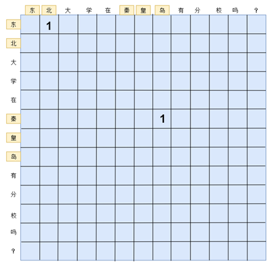

# 实验报告

## 概述

本文基于global-pointer实现命名实体识别任务（NER）。搭建的总体方法就是数据处理、编码、矩阵计算得到q、k向量序列、编入相对位置信息、计算得分。其中构建损失函数使用softmax+交叉熵，位置编码信息使用RoPE-通过绝对位置编码实现相对位置编码。模型训练时需要使用Bert的中文预训练模型bert-base-chinese。

## 实现

数据处理：通过torch的DataLoader，Dataset模块等实现。他的主要工作是处理格式。

GlobalPointer：使用torch.nn来重构(nn.Module)，加入forward向前计算函数，旋转编码位置信息。在globalpointer模型中，我设计加入encoder来处理上一步tokenizer转换好的数据，encoder使用Bert。

train：需要使用Bert的中文预训练模型bert-base-chinese作为encoder

下载预训练模型到文件夹pretrained_models

下载CLUENER数据集到datasets

运行train.py

训练完成的模型在outputs

运行evaluate.py

预测结果生成在results
